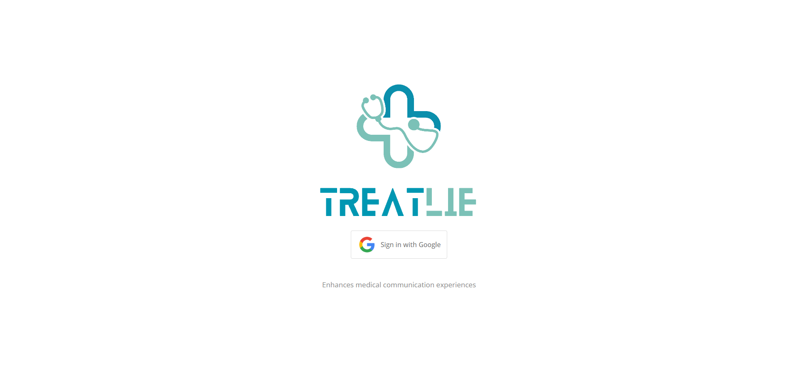
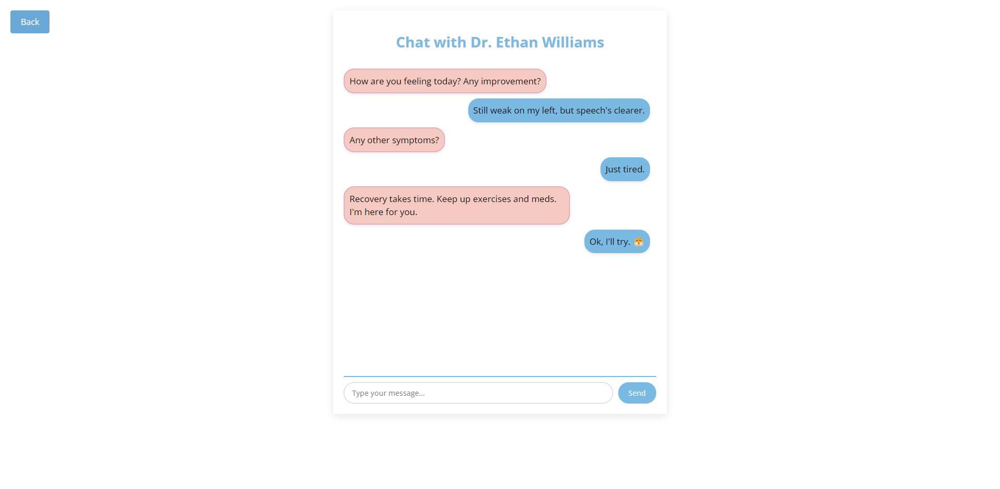
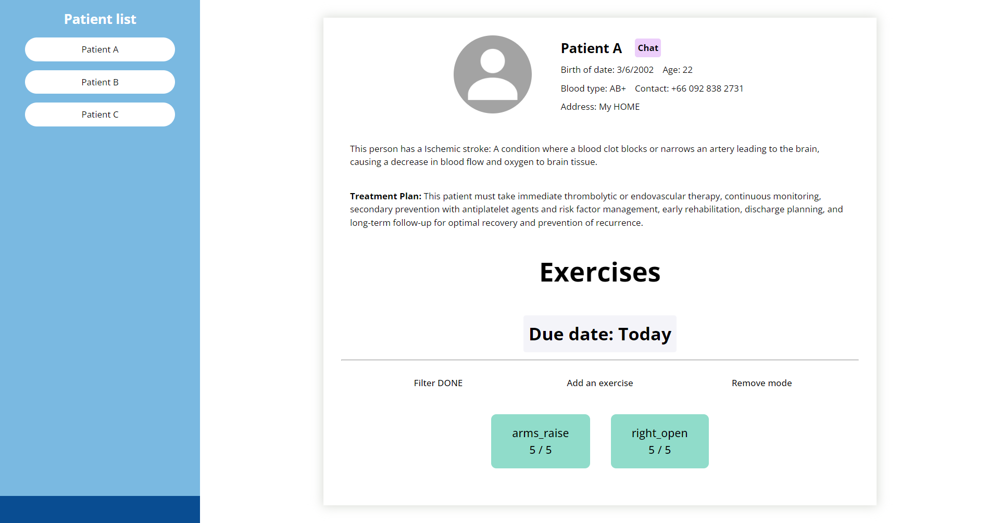
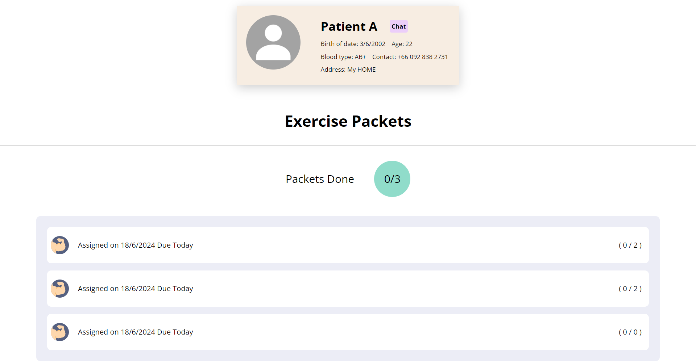

# Treatlie

 Dedicated to Student Innovation Campus 2024 
 

>This is web based application that tries to help the disabled and elderly who encounter stroke problems to feel more comfortable and more convenient in the treatment process. That means they don’t have to go for physical therapy at the hospital anymore. More specifically, the platform aims to enhance the stroke rehabilitation process in post medical session.

We utilize [mediapipe solutions](https://ai.google.dev/edge/mediapipe/solutions/guide) on patients' webcam to keep track of their pose and each body landmark to count the number of times left in particular exercise section in real time. 

# Snapshot

Landing|Chat system
:-----:|:-----:
 | 

Patient management Hub | Tasks and goals for patient
:-----:|:-----:
 |

# Tech Stack

 

> Note that this source code represents a finished prototype of the whole project idea and is obsoleted.